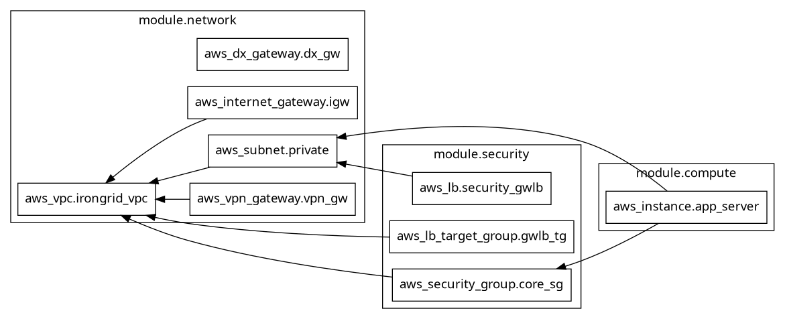

# AWS Project IronGrid ⚡

Infraestrutura como Código (IaC) modularizada para provisionamento de um ambiente AWS seguro e escalável.

## 🏗️ Topologia da Infraestrutura
O projeto foca em alta disponibilidade e segurança de borda, utilizando o **Gateway Load Balancer (GWLB)** para inspeção de tráfego.

## 🛠️ Componentes Principais
* **Network:** VPC Multi-AZ, Subnets Privadas/Públicas, Direct Connect Gateway e VPN Gateway.
* **Security:** Gateway Load Balancer, Target Groups com protocolo GENEVE e Security Groups restritivos.
* **Compute:** Instâncias EC2 (T3.medium) distribuídas em múltiplas Zonas de Disponibilidade.

## 🚀 Como Provisionar
1.  Navegue até: `terraform/environments/prod`
2.  Inicie o Terraform: `terraform init`
3.  Valide o plano: `terraform plan`
4.  Aplique as mudanças: `terraform apply`

---
*Desenvolvido por Wallace (IronGrid Project)*